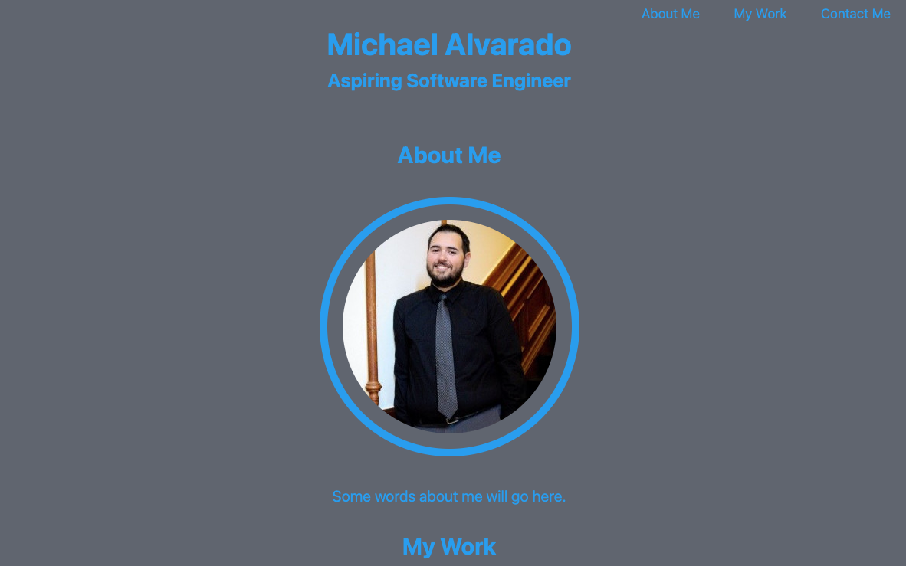

# Weekly Challenge 2 - Professional Portfolio

## Table of Contents

-[Screenshot](#ScreenShot)
-[Description](#Description)
-[Links](#Links)

## Screenshot 

## Description 

Challenge was to create an initial layout for a professional portfolio that contains my name, photo, and links to different sections of the page. It also needs to have a responsive layout that adjusts depending on the screens and devices viewing the page. Each image of the application needs to link to the application itself. 

## Links 

[Site Link](https://michael-alvarado.github.io/Professional-Portfolio/)
[Repository Link](https://github.com/Michael-Alvarado/Professional-Portfolio)
